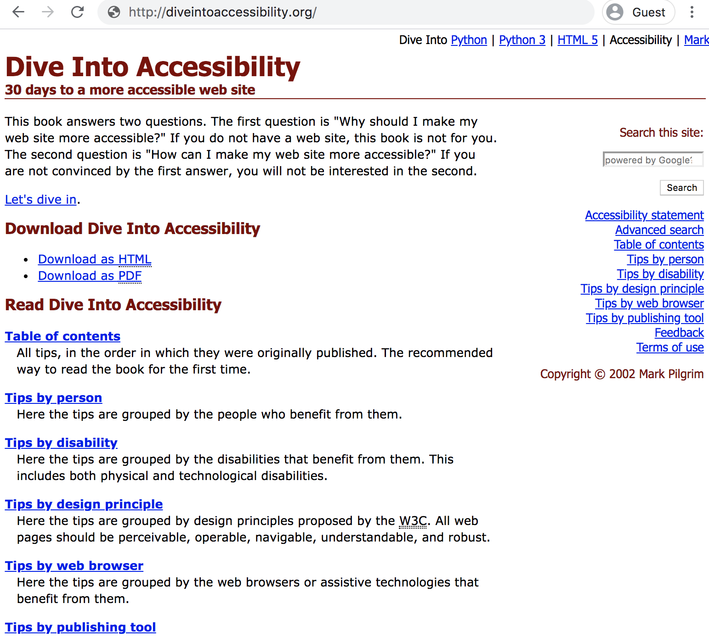

# Dive Into Accessibility

## 30 days to a more accessible web site
## By Mark Pilgrim

 * [WM archive of 'Dive into Accessibility'][archive]
 * [Errors and Caveats](docs/ERRATA.md)

### Why?

[Read][] [why][] this [repository][] of the book exists.

### Translations

* [Norwegian translation of Dive Into Accessibility][a11y-no-repo] ([Website][a11y-no-web]), by [@asbjornu][],
* [Polish translation of Dive Into Accessibility][a11y-pl-repo], by [@danie1k][],
* [Polish translation - website][a11y-pl-web], by Michał Świątkiewicz,
* [French translation][a11y-fr], by Karl Dubost,
* [Simplified Chinese translation][a11y-zh-hans],
* [Traditional Chinese translation][a11y-zh-hant],

## Archived Translations

* [Italian translation of Dive Into Accessibility][a11y-it], by Roberto Scano & Webaccessibile.org team,
* [Japanese translation][a11y-jp], by Mayu Shimizu _(incomplete)_,

### Other links

* [Dive Into HTML5][html5-jon], [@jonathantneal][],
* [Dive Into HTML5][html5-mis], [@mislav][],
* [Dive Into HTML5][html5-dive], [@diveintomark][],
* [Dive Into Python][python-dive], [@diveintomark][],

### Acknowledgements

The repository was created using:

* [WinHTTrack Website Copier 3.47-27][httrack]

### Copyright © 2002 Mark Pilgrim.

 * License: [GNU Free Documentation License][fdl].
 * [Terms of use][terms].

[Dive into - .info]: https://web.archive.org/web/*/http://diveintoaccessibility.info/
[archive]: https://web.archive.org/web/20110927131211/http://diveintoaccessibility.org/
  "Wayback Machine archive, from 2011-09-27."
[Read]: https://meyerweb.com/eric/thoughts/2011/10/04/searching-for-mark-pilgrim/
  "'Searching for Mark..' by Eric Meyer, 2011-10-04"
[why]:  https://html5doctor.com/dive-into-html5-doctor/ "Blog post by Oli Studholme, 2011-10-17."
[repository]: https://github.com/nfreear/diveintoaccessibility "Archived, 2015-02-10."
[fdl]: http://gnu.org/licenses/fdl-1.1.html "GNU Free Documentation License, Version 1.1"
[terms]: https://web.archive.org/web/20110927131332/diveintoaccessibility.org/terms_of_use.html
  "Terms of use (archive), on 2011-09-27."
[goodreads]: https://goodreads.com/book/show/12803358-dive-into-accessibility
[pdf]: https://kisd.de/~tom/ia/downloads/andere_accessibility.pdf
  "PDF of 'Dive Into Accessibility', on <kisd.de> (86 pages) (Cologne Int. School
of Design)"
[httrack]: https://www.httrack.com/
[was]: http://diveintoaccessibility.info

[@asbjornu]: https://github.com/asbjornu
[@danie1k]: https://github.com/danie1k
[@diveintomark]: https://github.com/diveintomark
[@jonathantneal]: https://github.com/jonathantneal
[@mislav]: https://github.com/mislav

[a11y-no-repo]: https://github.com/asbjornu/kastdegutitilgjengelighet.no
  "Norwegian translation of Dive Into Accessibility, by @asbjornu"
[a11y-no-web]: https://kastdegutitilgjengelighet.no/
[a11y-pl-repo]: https://github.com/danie1k/book-Dive-Into-Accessibility-Mark-Pilgrim
  "Polish translation of Dive Into Accessibility, by @danie1k"
[a11y-pl-web]: http://mimas.ceti.pl/dia/
  "Michał Świątkiewicz published a Polish translation"
[a11y-zh-hans]: http://dia.z6i.org/cn/
[a11y-zh-hant]: http://dia.z6i.org/
[a11y-fr]: https://www.la-grange.net/accessibilite/
  "French Translation of Dive Into Accessibility, by Karl Dubost"
[a11y-it]: https://web.archive.org/web/20170512085330/http://www.francocarcillo.it/dive/
  "Archive, 2017: Italian translation, by Roberto Scano (and Webaccessibile.org team)"
[a11y-jp]: https://web.archive.org/web/20130909031118/http://www.fliedlice.com/dive/
  "Archive, 2013: Japanese translation, by Mayu Shimizu (incomplete)"

[html5-jon]: https://github.com/jonathantneal/diveintohtml5
[html5-mis]: https://github.com/mislav/diveintohtml5
[html5-dive]: https://github.com/diveintomark/diveintohtml5
[python-dive]: https://github.com/diveintomark/diveintopython3
